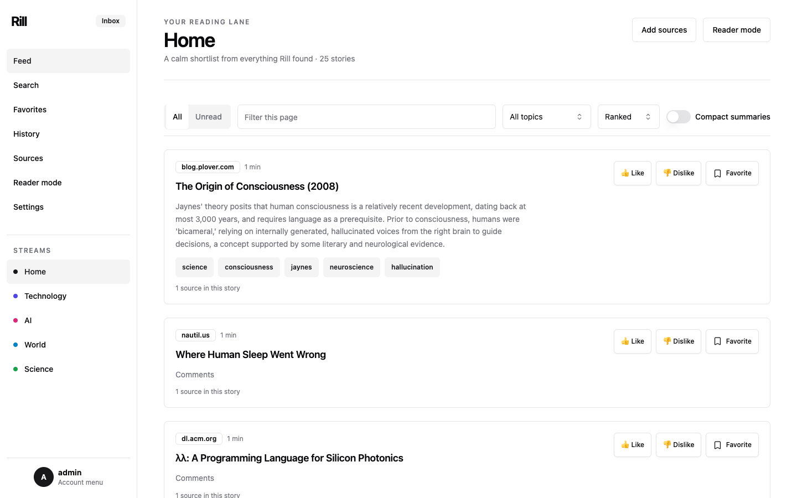

# Rill

Rill is a resource-conscious, self-hosted personalized news reader. One Rust
service and one SQLite database ingest RSS/Atom, public Telegram channels,
IMAP newsletters, and capability-limited WebAssembly source plugins. Rill
expands link roundups, preserves curator provenance, deduplicates articles,
clusters stories, summarizes and ranks them, and serves both a hydrated modern
UI and a no-JavaScript reader UI.

The implementation follows [Rill.md](Rill.md) and began from the reusable
[rust-solid-scriptc-scaffold](https://github.com/srsatt/rust-solid-scriptc-scaffold).

## Screenshots



<p align="center">
  
</p>

## Runtime shape

```text
sources -> durable jobs -> normalize/expand/extract -> dedup/cluster
        -> summaries/embeddings -> streams/ranking -> Solid pages

Solid TSX -> Vite SSR transform -> scriptc -> wasm32-wasi -> Wasmtime
Solid TSX -> Vite client build --------------------------> browser hydration
```

Node, pnpm, Vite, scriptc, and Zig are build-time tools only. Production needs
the stripped `rill` executable, renderer WASM, static assets, config, and
SQLite data directory. It does not embed a JavaScript runtime or require a
network database, Redis, or a vector service.

## Build and run

Prerequisites: Rust 1.96, Node 24+, pnpm 10, and Zig 0.16.

```bash
pnpm --dir ui install --frozen-lockfile
cargo xtask build-release
export RILL_MASTER_KEY="$(openssl rand -base64 32 | tr '+/' '-_' | tr -d '=')"
cargo run -p rill -- --config config/development.toml migrate
RILL_ADMIN_PASSWORD='choose-a-password' \
  cargo run -p rill -- --config config/development.toml \
  admin create --username admin
cargo run -p rill -- --config config/development.toml serve
```

For one-command local development after installing dependencies:

```bash
node tools/dev.mjs
```

This uses a temporary database, starts the deterministic source fixture,
creates `admin` with development-only password `rill-development-password`,
seeds the local fixture feed, Hacker News, `@genau`, and `@cortex_pulse`,
and rebuilds/restarts on Rust, UI, config, or migration changes. Set
`RILL_DEV_DATABASE_PATH` to retain the database.

Development model settings use the local Ollama OpenAI-compatible endpoint.
Install Ollama and make `embeddinggemma:latest` and `gemma4:e4b` available
before starting `tools/dev.mjs`. Rill uses them for 768-dimensional embeddings,
summary plus topic enrichment, collection parsing, and instruction-aware ranking;
model failures still fall back to the built-in local behavior.

For real deployments, inject `RILL_MASTER_KEY` and bootstrap passwords from a
restricted environment file or secret manager; do not keep the example shell
values. Open `/login`, `/admin`, `/stream/all`, `/reader/pair`,
`/health/live`, or `/health/ready` at the configured origin.

Useful CLI operations:

```bash
rill --config config.toml doctor
rill --config config.toml sources add-rss --user admin \
  --name Example --url https://example.com/feed.xml
rill --config config.toml sources poll SOURCE_ID
rill --config config.toml search --user admin "public software"
rill --config config.toml sessions revoke --user admin
rill --config config.toml backup /srv/backup/rill.db
rill --config config.toml plugins inspect ./source-plugin.wasm
```

## Sources and personalization

- RSS/Atom supports conditional requests and OPML import/export primitives.
- Telegram public channel previews are fetched once per channel and parsed into
  shared source items. Per-user subscriptions control visibility. An optional
  teloxide bot binds Telegram identity and accepts forwarded posts or usernames.
- Email uses IMAP over Rustls, UID cursors, bounded RFC822 bodies, and encrypted
  passwords.
- Source plugins use the versioned Component Model WIT in
  `crates/plugin-host/wit`; no WASI filesystem, environment, socket, process,
  or database capability is linked.
- Favorites remain local and durable even when an asynchronous HTTP Action
  fails. Actions use stable idempotency keys and bounded retries.

The built-in local feature-hash embedding, extractive summary, and ranker make
the product usable offline. External recommendation providers are optional and
fall back to local ranking on failure. Admins can swap embedding, ranking, and
text-parse HTTP providers live from global settings.

## Verification

```bash
pnpm --dir ui typecheck
cargo fmt --all --check
cargo clippy --workspace --all-targets -- -D warnings
cargo test --workspace --all-targets
cargo xtask test-e2e
cargo xtask build-release
cargo xtask measure
```

`scriptc coverage` is part of the UI build and must remain 100% static. The
reader build intentionally emits no referenced JavaScript.

## Documentation

- [Architecture](ARCHITECTURE.md)
- [Security and threat model](SECURITY.md)
- [Deployment, backup, and restore](docs/deployment.md)
- [Sources and collection expansion](docs/sources-and-collections.md)
- [Streams, reader pairing, and Actions](docs/streams-actions-reader.md)
- [Plugin authoring](docs/plugin-authoring.md)
- [Model providers](docs/model-providers.md)
- [OpenAPI](docs/openapi.yaml)
- [Resource measurements](docs/resource-measurements.md)
- [Implementation report](docs/implementation-report.md)
- [Alpha release plan](docs/alpha-release-plan.md)
- [Troubleshooting](docs/troubleshooting.md)
- [Contributing](CONTRIBUTING.md)
